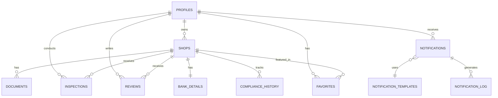

# Database Documentation

This document provides comprehensive information about the SSRMS database schema, relationships, and security policies.

## Table of Contents

- [Overview](#overview)
- [Database Schema](#database-schema)
- [Table Relationships](#table-relationships)
- [Row-Level Security](#row-level-security)
- [Database Functions](#database-functions)
- [Best Practices](#best-practices)

## Overview

SSRMS uses PostgreSQL via Lovable Cloud (Supabase) as its database. The database is designed with:
- **Row-Level Security (RLS)** for data protection
- **Role-based access control** for multi-user types
- **Referential integrity** via foreign keys
- **Automatic timestamps** for audit trails
- **Real-time subscriptions** for live updates

### Technology Stack
- **Database**: PostgreSQL 15+
- **Backend**: Lovable Cloud (Supabase)
- **ORM**: Supabase JavaScript Client
- **Real-time**: Supabase Realtime

## Database Schema

### Core Tables

#### 1. profiles
Stores user profile information and role assignments.

```sql
CREATE TABLE public.profiles (
  id UUID PRIMARY KEY REFERENCES auth.users(id),
  full_name TEXT,
  phone TEXT,
  role TEXT NOT NULL DEFAULT 'customer',
  department TEXT,
  position TEXT,
  created_at TIMESTAMPTZ DEFAULT now(),
  updated_at TIMESTAMPTZ DEFAULT now(),
  
  CONSTRAINT role_check CHECK (role IN ('customer', 'shop_owner', 'government'))
);
```

**Columns:**
- `id`: UUID - User ID from auth.users
- `full_name`: TEXT - User's full name
- `phone`: TEXT - Contact phone number
- `role`: TEXT - User role (customer, shop_owner, government)
- `department`: TEXT - Government officials only
- `position`: TEXT - Government officials only
- `created_at`: TIMESTAMPTZ - Record creation timestamp
- `updated_at`: TIMESTAMPTZ - Last update timestamp

**Indexes:**
- Primary key on `id`
- Index on `role` for filtering

**RLS Policies:**
```sql
-- Users can view all profiles
CREATE POLICY "Users can view all profiles" ON profiles
  FOR SELECT USING (true);

-- Users can insert their own profile
CREATE POLICY "Users can insert own profile" ON profiles
  FOR INSERT WITH CHECK (auth.uid() = id);

-- Users can update their own profile
CREATE POLICY "Users can update own profile" ON profiles
  FOR UPDATE USING (auth.uid() = id);
```

---

#### 2. shops
Stores spaza shop information, status, and compliance data.

```sql
CREATE TABLE public.shops (
  id UUID PRIMARY KEY DEFAULT gen_random_uuid(),
  owner_id UUID NOT NULL REFERENCES auth.users(id),
  name TEXT NOT NULL,
  business_name TEXT,
  registration_number TEXT,
  address TEXT NOT NULL,
  province TEXT NOT NULL,
  phone TEXT NOT NULL,
  email TEXT,
  status TEXT NOT NULL DEFAULT 'pending',
  compliance_status TEXT DEFAULT 'pending',
  compliance_score INTEGER DEFAULT 0,
  latitude NUMERIC,
  longitude NUMERIC,
  trading_hours JSONB,
  next_inspection_date DATE,
  last_compliance_check TIMESTAMPTZ,
  created_at TIMESTAMPTZ DEFAULT now(),
  updated_at TIMESTAMPTZ DEFAULT now(),
  
  CONSTRAINT status_check CHECK (status IN ('pending', 'approved', 'rejected', 'suspended')),
  CONSTRAINT compliance_check CHECK (compliance_status IN ('pending', 'compliant', 'non_compliant', 'warning')),
  CONSTRAINT score_range CHECK (compliance_score BETWEEN 0 AND 100)
);
```

**Key Features:**
- Geolocation support (latitude/longitude)
- Compliance tracking
- Status workflow management
- Flexible trading hours (JSONB)

**RLS Policies:**
```sql
-- Anyone can view approved shops
CREATE POLICY "Anyone can view approved shops" ON shops
  FOR SELECT USING (status = 'approved' OR owner_id = auth.uid());

-- Shop owners can insert their shops
CREATE POLICY "Shop owners can insert their shops" ON shops
  FOR INSERT WITH CHECK (auth.uid() = owner_id);

-- Shop owners can update their shops
CREATE POLICY "Shop owners can update their shops" ON shops
  FOR UPDATE USING (auth.uid() = owner_id);

-- Service role can update all shops
CREATE POLICY "Service role can update all shops" ON shops
  FOR UPDATE USING (true);
```

---

#### 3. documents
Stores shop-related documents (licenses, certificates, etc.).

```sql
CREATE TABLE public.documents (
  id UUID PRIMARY KEY DEFAULT gen_random_uuid(),
  shop_id UUID NOT NULL REFERENCES shops(id) ON DELETE CASCADE,
  type TEXT NOT NULL,
  name TEXT NOT NULL,
  file_url TEXT,
  status TEXT NOT NULL DEFAULT 'pending',
  expiry_date DATE,
  expiry_reminder_sent BOOLEAN DEFAULT false,
  last_reminder_date TIMESTAMPTZ,
  notes TEXT,
  reviewed_by UUID REFERENCES auth.users(id),
  reviewed_at TIMESTAMPTZ,
  uploaded_at TIMESTAMPTZ DEFAULT now(),
  
  CONSTRAINT doc_type_check CHECK (type IN (
    'business_license',
    'health_certificate',
    'fire_safety',
    'tax_clearance',
    'id_document',
    'proof_of_address',
    'other'
  )),
  CONSTRAINT doc_status_check CHECK (status IN ('pending', 'approved', 'rejected', 'expired'))
);
```

**Document Types:**
- Business License
- Health Certificate
- Fire Safety Certificate
- Tax Clearance
- ID Document
- Proof of Address
- Other

**RLS Policies:**
```sql
-- Shop owners can view their documents
CREATE POLICY "Shop owners can view their documents" ON documents
  FOR SELECT USING (
    shop_id IN (SELECT id FROM shops WHERE owner_id = auth.uid())
  );

-- Shop owners can insert their documents
CREATE POLICY "Shop owners can insert their documents" ON documents
  FOR INSERT WITH CHECK (
    shop_id IN (SELECT id FROM shops WHERE owner_id = auth.uid())
  );

-- Service role can update all documents
CREATE POLICY "Service role can update all documents" ON documents
  FOR UPDATE USING (true);
```

---

#### 4. inspections
Records government inspections of shops.

```sql
CREATE TABLE public.inspections (
  id UUID PRIMARY KEY DEFAULT gen_random_uuid(),
  shop_id UUID NOT NULL REFERENCES shops(id) ON DELETE CASCADE,
  inspector_id UUID REFERENCES auth.users(id),
  type TEXT NOT NULL,
  scheduled_date TIMESTAMPTZ NOT NULL,
  completed_date TIMESTAMPTZ,
  status TEXT NOT NULL DEFAULT 'scheduled',
  score INTEGER,
  issues TEXT[],
  notes TEXT,
  report_url TEXT,
  reminder_sent BOOLEAN DEFAULT false,
  created_at TIMESTAMPTZ DEFAULT now(),
  updated_at TIMESTAMPTZ DEFAULT now(),
  
  CONSTRAINT inspection_type_check CHECK (type IN (
    'routine',
    'complaint',
    'follow_up',
    'renewal'
  )),
  CONSTRAINT inspection_status_check CHECK (status IN (
    'scheduled',
    'in_progress',
    'completed',
    'cancelled'
  )),
  CONSTRAINT score_range CHECK (score BETWEEN 0 AND 100)
);
```

**Inspection Types:**
- Routine: Regular scheduled inspections
- Complaint: Based on customer complaints
- Follow-up: After previous non-compliance
- Renewal: For license renewals

**RLS Policies:**
```sql
-- Users can view inspections for their shops
CREATE POLICY "Users can view inspections for their shops" ON inspections
  FOR SELECT USING (
    shop_id IN (SELECT id FROM shops WHERE owner_id = auth.uid())
    OR inspector_id = auth.uid()
  );

-- Service role can manage inspections
CREATE POLICY "Service role can manage inspections" ON inspections
  FOR ALL USING (true);
```

---

#### 5. reviews
Customer reviews and ratings for shops.

```sql
CREATE TABLE public.reviews (
  id UUID PRIMARY KEY DEFAULT gen_random_uuid(),
  shop_id UUID NOT NULL REFERENCES shops(id) ON DELETE CASCADE,
  user_id UUID NOT NULL REFERENCES auth.users(id),
  rating INTEGER NOT NULL,
  comment TEXT,
  created_at TIMESTAMPTZ DEFAULT now(),
  
  CONSTRAINT rating_range CHECK (rating BETWEEN 1 AND 5),
  CONSTRAINT unique_user_shop_review UNIQUE (user_id, shop_id)
);
```

**Features:**
- One review per user per shop
- 1-5 star rating system
- Optional text comments

**RLS Policies:**
```sql
-- Anyone can view reviews
CREATE POLICY "Anyone can view reviews" ON reviews
  FOR SELECT USING (true);

-- Users can insert reviews
CREATE POLICY "Users can insert reviews" ON reviews
  FOR INSERT WITH CHECK (auth.uid() = user_id);

-- Users can update their own reviews
CREATE POLICY "Users can update their own reviews" ON reviews
  FOR UPDATE USING (auth.uid() = user_id);

-- Users can delete their own reviews
CREATE POLICY "Users can delete their own reviews" ON reviews
  FOR DELETE USING (auth.uid() = user_id);
```

---

#### 6. notifications
System notifications for users.

```sql
CREATE TABLE public.notifications (
  id UUID PRIMARY KEY DEFAULT gen_random_uuid(),
  user_id UUID NOT NULL REFERENCES auth.users(id) ON DELETE CASCADE,
  shop_id UUID REFERENCES shops(id) ON DELETE CASCADE,
  type TEXT NOT NULL,
  title TEXT NOT NULL,
  message TEXT NOT NULL,
  read BOOLEAN DEFAULT false,
  created_at TIMESTAMPTZ DEFAULT now(),
  
  CONSTRAINT notification_type_check CHECK (type IN (
    'shop_approved',
    'shop_rejected',
    'document_expiring',
    'inspection_scheduled',
    'inspection_completed',
    'review_received',
    'compliance_warning',
    'system_announcement'
  ))
);
```

**Notification Types:**
- Shop status changes
- Document expiration warnings
- Inspection scheduling
- Review notifications
- Compliance warnings
- System announcements

**RLS Policies:**
```sql
-- Users can view their notifications
CREATE POLICY "Users can view their notifications" ON notifications
  FOR SELECT USING (auth.uid() = user_id);

-- Users can update their notifications
CREATE POLICY "Users can update their notifications" ON notifications
  FOR UPDATE USING (auth.uid() = user_id);

-- Service role can insert notifications
CREATE POLICY "Service role can insert notifications" ON notifications
  FOR ALL USING (true);
```

---

#### 7. activities
Activity log for auditing.

```sql
CREATE TABLE public.activities (
  id UUID PRIMARY KEY DEFAULT gen_random_uuid(),
  user_id UUID REFERENCES auth.users(id),
  shop_id UUID REFERENCES shops(id),
  type TEXT NOT NULL,
  description TEXT NOT NULL,
  created_at TIMESTAMPTZ DEFAULT now()
);
```

**RLS Policies:**
```sql
-- Users can view their activities
CREATE POLICY "Users can view their activities" ON activities
  FOR SELECT USING (auth.uid() = user_id);

-- Service role can insert activities
CREATE POLICY "Service role can insert activities" ON activities
  FOR INSERT USING (true);
```

---

#### 8. favorites
Customer favorite shops.

```sql
CREATE TABLE public.favorites (
  id UUID PRIMARY KEY DEFAULT gen_random_uuid(),
  user_id UUID NOT NULL REFERENCES auth.users(id) ON DELETE CASCADE,
  shop_id UUID NOT NULL REFERENCES shops(id) ON DELETE CASCADE,
  created_at TIMESTAMPTZ DEFAULT now(),
  
  CONSTRAINT unique_user_shop_favorite UNIQUE (user_id, shop_id)
);
```

**RLS Policies:**
```sql
-- Users can view their favorites
CREATE POLICY "Users can view their favorites" ON favorites
  FOR SELECT USING (auth.uid() = user_id);

-- Users can insert favorites
CREATE POLICY "Users can insert favorites" ON favorites
  FOR INSERT WITH CHECK (auth.uid() = user_id);

-- Users can delete their favorites
CREATE POLICY "Users can delete their favorites" ON favorites
  FOR DELETE USING (auth.uid() = user_id);
```

---

#### 9. bank_details
Shop payment information.

```sql
CREATE TABLE public.bank_details (
  id UUID PRIMARY KEY DEFAULT gen_random_uuid(),
  shop_id UUID NOT NULL REFERENCES shops(id) ON DELETE CASCADE UNIQUE,
  bank_name TEXT NOT NULL,
  account_holder TEXT NOT NULL,
  account_number TEXT NOT NULL,
  account_type TEXT NOT NULL,
  branch_code TEXT,
  created_at TIMESTAMPTZ DEFAULT now(),
  
  CONSTRAINT account_type_check CHECK (account_type IN ('savings', 'cheque', 'business'))
);
```

**RLS Policies:**
```sql
-- Shop owners can view their bank details
CREATE POLICY "Shop owners can view their bank details" ON bank_details
  FOR SELECT USING (
    shop_id IN (SELECT id FROM shops WHERE owner_id = auth.uid())
  );

-- Shop owners can insert their bank details
CREATE POLICY "Shop owners can insert their bank details" ON bank_details
  FOR INSERT WITH CHECK (
    shop_id IN (SELECT id FROM shops WHERE owner_id = auth.uid())
  );
```

---

#### 10. compliance_history
Historical compliance scores for tracking.

```sql
CREATE TABLE public.compliance_history (
  id UUID PRIMARY KEY DEFAULT gen_random_uuid(),
  shop_id UUID NOT NULL REFERENCES shops(id) ON DELETE CASCADE,
  score INTEGER NOT NULL,
  factors JSONB,
  calculated_at TIMESTAMPTZ DEFAULT now(),
  
  CONSTRAINT score_range CHECK (score BETWEEN 0 AND 100)
);
```

**RLS Policies:**
```sql
-- Shop owners can view their compliance history
CREATE POLICY "Shop owners can view their compliance history" ON compliance_history
  FOR SELECT USING (
    shop_id IN (SELECT id FROM shops WHERE owner_id = auth.uid())
  );

-- Service role can manage compliance history
CREATE POLICY "Service role can manage compliance history" ON compliance_history
  FOR ALL USING (true);
```

---

#### 11. notification_templates
Templates for automated notifications.

```sql
CREATE TABLE public.notification_templates (
  id UUID PRIMARY KEY DEFAULT gen_random_uuid(),
  name TEXT NOT NULL UNIQUE,
  subject TEXT,
  email_body TEXT,
  sms_body TEXT,
  variables JSONB,
  created_at TIMESTAMPTZ DEFAULT now()
);
```

**RLS Policies:**
```sql
-- Users can view notification templates
CREATE POLICY "Users can view notification templates" ON notification_templates
  FOR SELECT USING (true);
```

---

#### 12. notification_log
Log of sent notifications.

```sql
CREATE TABLE public.notification_log (
  id UUID PRIMARY KEY DEFAULT gen_random_uuid(),
  notification_id UUID REFERENCES notifications(id),
  channel TEXT NOT NULL,
  recipient TEXT NOT NULL,
  status TEXT DEFAULT 'pending',
  error_message TEXT,
  sent_at TIMESTAMPTZ,
  created_at TIMESTAMPTZ DEFAULT now(),
  
  CONSTRAINT channel_check CHECK (channel IN ('email', 'sms', 'push', 'in_app')),
  CONSTRAINT status_check CHECK (status IN ('pending', 'sent', 'failed'))
);
```

**RLS Policies:**
```sql
-- Service role can manage notification logs
CREATE POLICY "Service role can manage notification logs" ON notification_log
  FOR ALL USING (true);
```

## Table Relationships



## Database Functions

### 1. handle_new_user()
Automatically creates profile for new users.

```sql
CREATE OR REPLACE FUNCTION public.handle_new_user()
RETURNS TRIGGER
LANGUAGE plpgsql
SECURITY DEFINER
SET search_path = public
AS $$
BEGIN
  INSERT INTO profiles (id, full_name, role)
  VALUES (
    NEW.id,
    COALESCE(NEW.raw_user_meta_data->>'full_name', ''),
    COALESCE(NEW.raw_user_meta_data->>'role', 'customer')
  );
  RETURN NEW;
END;
$$;

-- Trigger
CREATE TRIGGER on_auth_user_created
  AFTER INSERT ON auth.users
  FOR EACH ROW
  EXECUTE FUNCTION handle_new_user();
```

### 2. update_updated_at_column()
Updates the `updated_at` timestamp automatically.

```sql
CREATE OR REPLACE FUNCTION public.update_updated_at_column()
RETURNS TRIGGER
LANGUAGE plpgsql
AS $$
BEGIN
  NEW.updated_at = now();
  RETURN NEW;
END;
$$;

-- Apply to relevant tables
CREATE TRIGGER update_shops_updated_at
  BEFORE UPDATE ON shops
  FOR EACH ROW
  EXECUTE FUNCTION update_updated_at_column();

CREATE TRIGGER update_profiles_updated_at
  BEFORE UPDATE ON profiles
  FOR EACH ROW
  EXECUTE FUNCTION update_updated_at_column();
```

## Best Practices

### Query Optimization

1. **Use Indexes Wisely**
   ```sql
   -- Add indexes for frequently queried columns
   CREATE INDEX idx_shops_status ON shops(status);
   CREATE INDEX idx_shops_owner ON shops(owner_id);
   CREATE INDEX idx_documents_shop ON documents(shop_id);
   ```

2. **Limit Result Sets**
   ```typescript
   // Always paginate large queries
   const { data } = await supabase
     .from('shops')
     .select('*')
     .range(0, 9); // First 10 results
   ```

3. **Select Only Needed Columns**
   ```typescript
   // Don't use SELECT *
   const { data } = await supabase
     .from('shops')
     .select('id, name, compliance_score');
   ```

### Security Best Practices

1. **Always Enable RLS**
   ```sql
   ALTER TABLE table_name ENABLE ROW LEVEL SECURITY;
   ```

2. **Test RLS Policies**
   ```sql
   -- Test as specific user
   SET LOCAL ROLE authenticated;
   SET request.jwt.claim.sub = 'user-uuid';
   SELECT * FROM shops;
   ```

3. **Use Security Definer Functions Carefully**
   - Only when necessary for RLS bypass
   - Always validate inputs
   - Set explicit search_path

### Data Integrity

1. **Use Foreign Keys**
   - Maintain referential integrity
   - Use appropriate ON DELETE actions

2. **Add Constraints**
   - Check constraints for valid values
   - Unique constraints for business rules

3. **Validate Data**
   - Client-side validation
   - Database-level constraints
   - Server-side validation in edge functions

### Maintenance

1. **Regular Backups**
   - Lovable Cloud provides automatic backups
   - Test restore procedures regularly

2. **Monitor Performance**
   - Watch for slow queries
   - Monitor table sizes
   - Review index usage

3. **Clean Up Data**
   - Archive old records
   - Remove orphaned data
   - Vacuum tables regularly

---

For questions about the database schema, contact: support@ssrms.co.za
